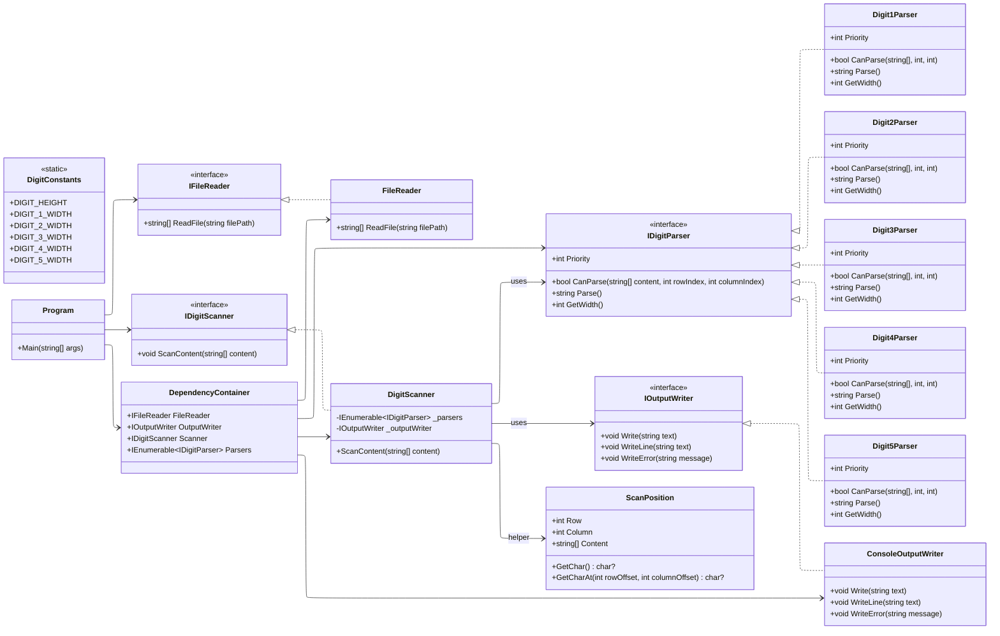
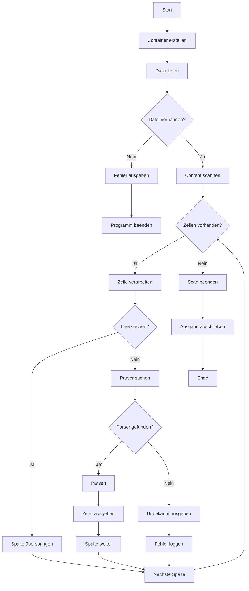

# Projektbeschreibung – Zahlen-Erkennung aus Textdatei

Dieses Projekt ist im Rahmen einer Coding-Challenge entstanden.  
Die Aufgabe besteht darin, ein Programm zu entwickeln, das aus einer Textdatei eingelesene Zahlen erkennt und diese korrekt auf dem Bildschirm ausgibt.

## Aufgabenstellung

In einer Textdatei sind die Zahlen `3, 2, 1, 4, 5` mithilfe von horizontalen und vertikalen Strichen kodiert.  
Das Programm wurde mit **.NET (Konsolenanwendung)** in **C#** erstellt.

## Ziele

- **Saubere Strukturierung**: Der Programmaufbau soll so gestaltet sein, dass mehrere Entwickler gleichzeitig daran arbeiten können.  
- **Modularität**: Einzelne Module sollen unabhängig voneinander entwickelt, ausgetauscht und getestet werden können.  

## UML-Diagramm



## Ablauf-Diagramm


## Installation & Ausführung

Voraussetzungen:
- Installiertes .NET SDK

Schritte:

1. Repository klonen oder Projektdateien herunterladen
2. Im Projektordner ein Terminal öffnen
3. Anwendung starten mit:
```bash
cd number-parser
dotnet run
```
